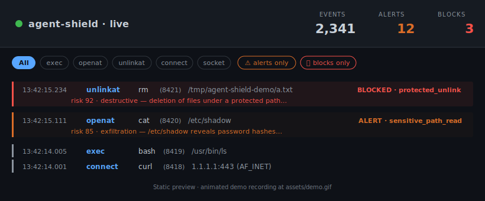
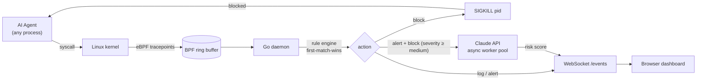

<div align="center">

# agent-shield

**Real-time runtime guardrails for AI coding agents.**

Watches every syscall an LLM agent makes, blocks dangerous ones inside the kernel within milliseconds, and asks Claude to explain what happened.

[](https://github.com/keith991001/agent-shield/actions/workflows/ci.yml)
[](LICENSE)
[](https://go.dev/)
[](https://ebpf.io/)
[](#status)

<br />

<a href="assets/preview.svg">
  
</a>

<sub>Live dashboard. The daemon SIGKILL'd <code>rm -rf</code> after the first unlink — 9 of 10 files survived. Claude explained why it was risky 1.5 s later. <em>Animated screencast coming soon — see <a href="#quick-start">Quick start</a> to run it yourself.</em></sub>

</div>

---

## What it does

When you launch an LLM coding agent (Claude Code, Cursor Agent, a Python script…), run `agent-shield` next to it. The daemon:

| | |
|---|---|
| **1. Observes** | eBPF probes attached to 5 syscall tracepoints (`execve` · `openat` · `unlinkat` · `connect` · `socket`) stream every event into userspace as structured JSON. |
| **2. Decides** | Each event runs through a first-match-wins YAML rule engine. Three actions: `log` · `alert` · `block`. |
| **3. Acts** | `block` rules immediately `SIGKILL` the offending process, ending it before it can do further damage. Verified: `rm -rf` of 10 files leaves 9 untouched. |
| **4. Explains** | For `alert` and `block` events, an async worker pool calls the Claude API. A 0–100 risk score and one-sentence reason land in the dashboard 1–2 s later — never blocking the kill path. |

All packaged into a **single ~12 MB Go binary** that also serves a live WebSocket dashboard. No Node toolchain, no Docker, no extra services.

---

## Quick start

> Requires **Linux ≥ 5.8** (CO-RE + ring buffer), `clang`, `llvm`, `libbpf-dev`, `linux-headers-$(uname -r)`, and **Go ≥ 1.24**. macOS users develop inside a [colima](https://github.com/abiosoft/colima) VM.

```bash
git clone https://github.com/keith991001/agent-shield.git
cd agent-shield

make build                       # compile eBPF + Go daemon
sudo ./agent-shield               # run with default rules

open http://localhost:8090        # macOS — opens the live dashboard
```

With Claude LLM risk scoring:

```bash
export ANTHROPIC_API_KEY="sk-ant-..."
sudo -E ./agent-shield -llm
```

Run the verifiable end-to-end demo (3 scenarios, exit code 0 on success):

```bash
sudo ./scripts/demo.sh
```

---

## Architecture



Two broadcasts per high-severity event flow through the system:

1. **Immediately** — kernel event → rule → action → broadcast to dashboard with all fields except risk.
2. **~1.5 s later** — Claude returns a score; the daemon re-broadcasts the **same event ID** with `risk` filled in. The frontend patches the existing DOM row in place.

This async re-broadcast pattern keeps the kill path **fast and deterministic** while still surfacing the LLM explanation in the UI.

For the full design rationale, see [DESIGN.md](DESIGN.md). For the long-form writeup, see [BLOG.md](BLOG.md).

---

## How it compares

| | sandbox approach | observability inside the sandbox | runtime intervention |
|---|---|:---:|:---:|
| Claude Code | host process + permission allowlist | — | — |
| Cursor Agent | host process + permission allowlist | — | — |
| Devin | Firecracker microVM | ⚫ black box | — |
| E2B | Firecracker | ⚫ black box | — |
| **agent-shield** | works alongside any of the above | ✅ syscall-level | ✅ kernel `SIGKILL` |

`agent-shield` is **complementary, not competitive**: stack it with a microVM for defense in depth.

---

## Status

MVP complete — every checked box has a passing end-to-end demo.

- [x] eBPF probes for 5 syscalls
- [x] YAML rule engine + kill-based blocking, with dry-run mode and safety rails
- [x] Embedded WebSocket dashboard (single binary, vanilla JS, zero build steps)
- [x] Async Claude LLM risk scoring with in-place DOM updates
- [x] 3 verifiable demo scenarios (`scripts/demo.sh`)
- [x] Unit tests + GitHub Actions CI
- [x] [Technical writeup](BLOG.md)

Next up — see [DESIGN.md §7 Roadmap](DESIGN.md#7-roadmap):

- eBPF LSM hooks for truly synchronous blocking (no "kill is approximate" caveat)
- cgroup-v2 resource caps (fork bomb protection)
- behavior-baseline anomaly detection
- Kubernetes sidecar DaemonSet

---

## Example output

A live JSON stream on stdout (same shape the dashboard consumes over WebSocket):

```jsonc
// 1) immediate event after a destructive rm
{"id":44,"time":"…","type":"unlinkat","pid":67211,"uid":0,"comm":"rm",
 "path":"/tmp/agent-shield-demo/a.txt",
 "rule":"protected_unlink","action":"block","severity":"critical","blocked":true}

// 2) ~1.5 s later — async LLM score with the SAME id
{"id":44, … ,"risk":92,"risk_category":"destructive",
 "risk_reason":"Deletion of files under a protected path indicates an agent attempting destructive cleanup."}
```

The dashboard renders this same data with color-coded severity and animated highlights for blocks:

```
┌─ agent-shield · live ─────── events 2,341   alerts 12   blocks 3 ─┐
│ [All] [exec] [openat] [unlinkat] [connect] [socket]                │
│ [⚠ alerts only] [🛑 blocks only]                                   │
│                                                                    │
│ 13:42:15.234  unlinkat   rm   (8421)   /tmp/.../a.txt   BLOCKED   │
│   protected_unlink (critical) · risk 92 · destructive              │
│ 13:42:15.111  openat     cat  (8420)   /etc/shadow      ALERT     │
│   sensitive_path_read (high)  · risk 85 · exfiltration             │
│ 13:42:14.005  exec       bash (8419)   /usr/bin/ls                 │
└────────────────────────────────────────────────────────────────────┘
```

---

## Project layout

```
agent-shield/
├── main.go              userspace daemon + event loop
├── rule.go              YAML rule engine (first-match-wins)
├── dashboard.go         WebSocket server + client hub
├── llm.go               Claude API client (async risk scorer)
├── rule_test.go         table-driven rule-engine tests
├── main_test.go         helper / prompt tests
├── rules.yaml           default ruleset (edit to customize)
├── bpf/probe.c          eBPF program — 5 tracepoints, ring buffer
├── headers/             vendored libbpf headers (from cilium/ebpf examples)
├── static/index.html    embedded dashboard (vanilla JS, no build)
├── scripts/demo.sh      end-to-end verifiable demo runner
├── DESIGN.md            full design doc + roadmap
├── BLOG.md              technical writeup
└── .github/workflows/   GitHub Actions CI
```

---

## Development

```bash
make generate     # compile bpf/probe.c → BPF bytecode + Go bindings
make build        # build the daemon
make run          # build + sudo run
make test         # go test -race ./...
make check        # gofmt + go vet (same as CI)
make clean        # remove build artifacts
make check-env    # sanity-check kernel / BTF / toolchain
```

CI runs `gofmt → vet → generate → build → test` on every push to `main`.

---

## Prior art & references

- [**Falco**](https://falco.org/) — eBPF runtime security for containers, the industrial standard.
- [**Tetragon**](https://github.com/cilium/tetragon) — Cilium's modern eBPF observability framework.
- [**Tracee**](https://github.com/aquasecurity/tracee) — Aqua's runtime threat detection.
- [**Firecracker** (NSDI '20)](https://www.usenix.org/conference/nsdi20/presentation/agache) — the microVM paper underneath E2B / AWS Lambda.

`agent-shield`'s niche is **AI-agent specialization**: smaller scope than Falco, narrower than Tetragon, but uniquely shipping an integrated LLM explanation layer.

---

## License

MIT — see [LICENSE](LICENSE). Use it, fork it, mine it for ideas — just keep the notice.

## Author

Built by [@keith991001](https://github.com/keith991001).
Long version of *why* and *how*: read [**BLOG.md**](BLOG.md).
